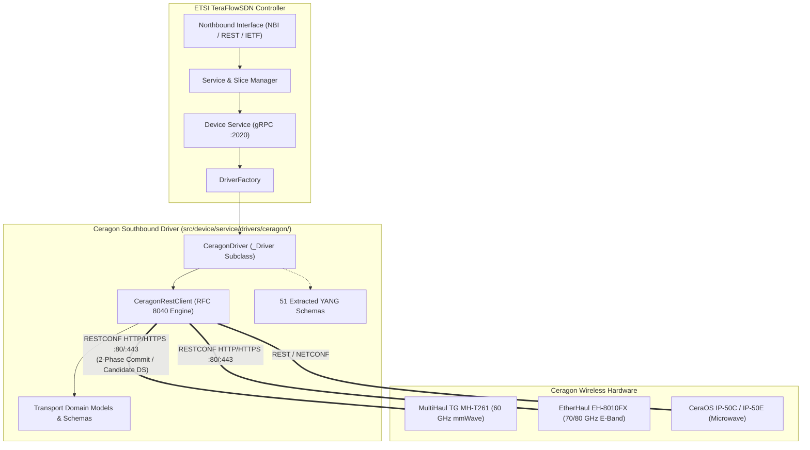

# ETSI TeraFlowSDN Controller

The [ETSI Software Development Group TeraFlowSDN (SDG TFS)](https://tfs.etsi.org/) is developing an open source cloud native SDN controller enabling smart connectivity services for future networks beyond 5G.

The project originated from "[Teraflow H2020 project](https://teraflow-h2020.eu/) - Secured autonomic traffic management for a Tera of SDN Flows", a project funded by the European Union’s Horizon 2020 Research and Innovation programme that finished on 30th June 2023.

---

## Ceragon Wireless Radio Transport Driver (Southbound Interface)

This repository includes the native **Ceragon Wireless Radio Transport Driver** (`src/device/service/drivers/ceragon/`), providing ETSI TeraFlowSDN with Southbound Interface (SBI) control over Ceragon millimeter-wave (mmWave), E-band, and microwave radio links.

### Key Capabilities

- **RFC 8040 RESTCONF Candidate Datastore Architecture**: Full transaction management utilizing the 2-Phase Commit pattern (`PATCH /restconf/ds/ietf-datastores:candidate` followed by atomic `ietf-netconf:commit`, with automated rollback via `discard-changes` on validation failure).
- **Automated Endpoint & Topology Discovery**: Introspects physical hardware and registers copper ports (RJ-45, SFP+ 1G/10G) and wireless radio sectors (`rf-sector`, phased array beamforming antennas) into the TFS Context and Topology services.
- **Dynamic Radio Parameter Tuning**: Programmatic configuration of carrier frequency, channel bandwidth, transmit power, and ATPC (Automatic Transmit Power Control).
- **Transport Network Slicing**: Dynamic instantiation and teardown of IEEE 802.1Q VLAN sub-interfaces, bridge domains, and token-bucket bandwidth shaping profiles.
- **Adaptive Modulation & Coding (ACM) Floor Hardening**: Weather-aware intent dispatching enforcing minimum MCS floors to protect ultra-reliable low-latency communications (URLLC) during rain-fade events.
- **51 Physical YANG Data Models Bundled**: Complete RFC-compliant schema library extracted directly from physical hardware via RFC 6022 NETCONF monitoring (`radio-bridge-tg-*`, `ieee802-dot1q-*`, `ietf-*`).
- **Telemetry & Real-Time Monitoring**: Streaming and on-demand polling of thermal sensors (modem/RF temperatures), RSSI, SNR, and link loss metrics into the TFS Monitoring Service.

### Supported Hardware Families

| Hardware Family | Model Series | Frequency Band | Max Throughput | Interface Types | Datastore Engine |
| :--- | :--- | :--- | :--- | :--- | :--- |
| **MultiHaul TG** | `MH-T261`, `MH-T280`, `MH-N366` | 57–66 GHz (V-Band) | Up to 3.8 Gbps | 1G/10G Copper & SFP+ | Clixon RFC 8040 RESTCONF |
| **EtherHaul** | `EH-8010FX`, `EH-2500FX`, `EH-1200` | 70/80 GHz (E-Band) | Up to 10 Gbps | 1G/10G SFP+ | RESTCONF Candidate |
| **CeraOS Microwave** | `IP-50C`, `IP-50E`, `IP-20C`, `IP-20N` | 6–42 GHz (Microwave) | Up to 20 Gbps (XPIC/MRMC) | Multi-Gigabit Carrier Ethernet | CeraOS REST / NETCONF |

---

### Architecture Overview



---

### Quick Start: Onboarding a Ceragon Device in TFS

Onboard a Ceragon device by uploading a standard TFS descriptor via the WebUI or the NBI REST API:

```bash
curl -X POST http://<tfs-ip>:8088/api/v1/devices \
  -H "Content-Type: application/json" \
  -d @manifests/ceragon_mh_t261_descriptor.json
```

**Descriptor Example (`manifests/ceragon_mh_t261_descriptor.json`)**:

```json
{
  "devices": [
    {
      "device_id": {
        "device_uuid": {
          "uuid": "ceragon-mh-t261-ctu-96"
        }
      },
      "device_type": "microwave-radio-system",
      "device_config": {
        "config_rules": [
          {
            "action": 1,
            "custom": {
              "resource_key": "_connect/address",
              "resource_value": "192.168.1.225"
            }
          },
          {
            "action": 1,
            "custom": {
              "resource_key": "_connect/port",
              "resource_value": "80"
            }
          },
          {
            "action": 1,
            "custom": {
              "resource_key": "_connect/settings",
              "resource_value": {
                "username": "admin",
                "password": "admin",
                "scheme": "http",
                "timeout": 15
              }
            }
          }
        ]
      },
      "device_operational_status": 1,
      "device_drivers": [22],
      "device_endpoints": []
    }
  ]
}
```

---

### Running the Ceragon Driver Unit Tests

Run the full pytest suite from the repository root:

```bash
PYTHONPATH=src pytest -v src/device/tests/test_driver_ceragon.py
```

### Detailed Documentation & Specifications

- **Driver Reference & Usage**: [`src/device/service/drivers/ceragon/README.md`](src/device/service/drivers/ceragon/README.md)
- **Technical Driver Specification**: [`docs/CERAGON_DRIVER_SPECIFICATION.md`](docs/CERAGON_DRIVER_SPECIFICATION.md)
- **Contribution Guide**: [`docs/ETSI_TFS_CONTRIBUTION_GUIDE.md`](docs/ETSI_TFS_CONTRIBUTION_GUIDE.md)

---

## Available branches and releases

[](https://labs.etsi.org/rep/tfs/controller/-/releases)

- The branch `main` points to the primary branch of this fork, containing the official ETSI TeraFlowSDN 7.0 release integrated with the Ceragon Southbound REST adapter.
- The branch `feat/ceragon-transport-driver` tracks dedicated feature development for the Ceragon driver.

## Documentation
The [TeraFlowSDN Wiki](https://labs.etsi.org/rep/tfs/controller/-/wikis/home) pages include the upstream documentation for the ETSI TeraFlowSDN Controller.
